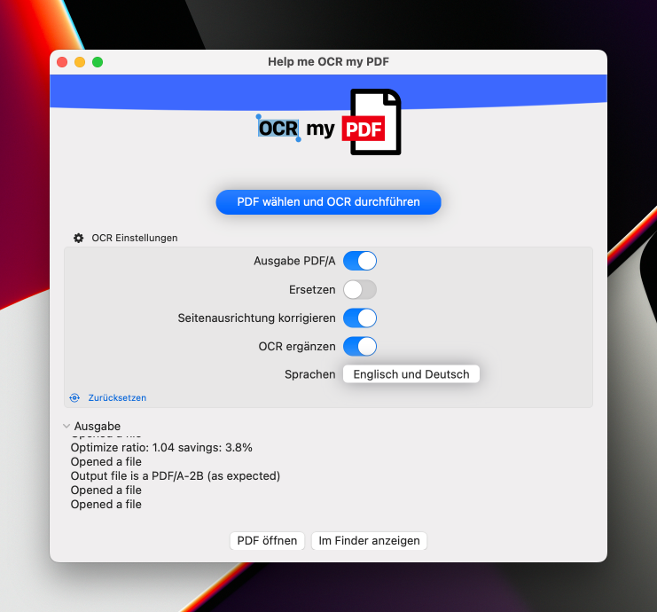

#  (Swift) GUI4OCRmyPDF

This is a side project to learn swiftui.

While on macos there is already a way to ocr pdfs (with https://developer.apple.com/documentation/visionkit ?), I am used to ocr my pdf (https://ocrmypdf.readthedocs.io/en/latest/index.html)
But ocr my pdf has only a cli interface. So I created a simple Swift GUI to help me ocr my pdfs.

## Some findings
* To execute shell command line commands, start the shell using Process and pass the command to be executed as a parameter. For zsh, the "-ic" options cause the shell to start in interactive mode ('-i') and execute the command ('-c').
* The GUI assumes that 'ocrmypdf' is installed and can be started via command line. In my case ocrmypdf is under '/opt/homebrew/bin/ocrmypdf'.
* Currently I was only able to run the ocrmypdf command when the sanbox option for the app was disabled.
* Passing the shell output to the SwiftUI text control was a challenge, but was implemented well.
* I'm not quite sure yet if and how to use the existing ButtonStyles

## Screenshots

